# MJU Auto Login

**명지대 통합로그인, 이제 클릭 없이.**

 


## ✅ 크롬과 엣지 모두 지원합니다

MJU Auto Login은 명지대학교 아스트라(LMS), MSI 등 통합로그인(SSO)을 사용하는 사이트에 로그아웃 상태로 접속했을 때,   
브라우저에 저장된 계정으로 로그인 과정을 자동으로 진행하는 확장 프로그램입니다.  
브라우저를 다시 열 때마다 반복하던 여러 번의 클릭이 필요 없어집니다.

## ⚡ 북마크 클릭부터 아스트라 메인 화면까지 **1.03초**

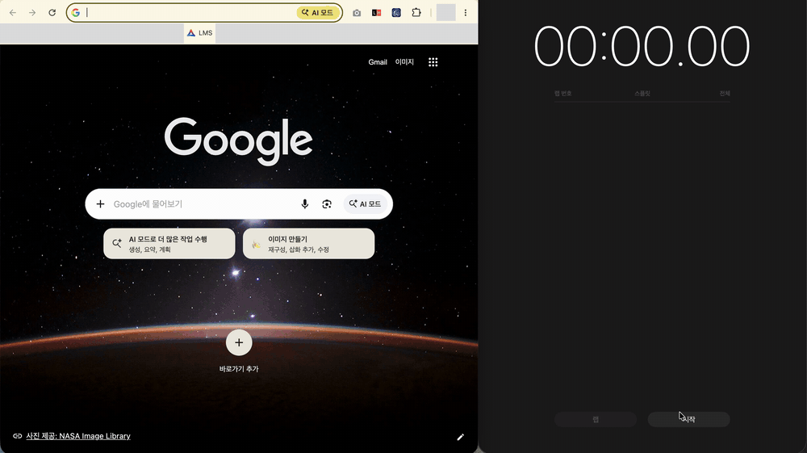

## 목차

- 📘 [**사용 안내**](#사용-안내) — 설치하고 쓰려는 분
  - [지원 브라우저](#지원-브라우저)
  - [크롬 준비](#크롬-준비)
  - [엣지 준비](#엣지-준비)
  - [설치](#설치)
  - [켜고 끄기](#켜고-끄기)
  - [개인정보](#개인정보)
- 🛠 [**개발 기록**](#개발-기록) — 어떻게 만들었는지 궁금한 분
  - [처음 생각한 문제](#처음-생각한-문제)
  - [조사하며 발견한 한계](#조사하며-발견한-한계)
  - [최종 문제 정의](#최종-문제-정의)
  - [해결방법들](#해결방법들)
  - [선택한 방법과 그 이유](#선택한-방법과-그-이유)
  - [결과와 한계](#결과와-한계)
  - [엣지 지원 추가](#엣지-지원-추가)
- [기여](#기여) · [라이선스](#라이선스)

---

# 사용 안내

## 지원 브라우저


| 브라우저   | 지원          |
| ------ | ----------- |
| **크롬** | ✅           |
| **엣지** | ✅ (0.3.0부터) |


## 크롬 준비

이 확장 프로그램은 크롬 비밀번호 관리자에 저장된 계정을 받아서 로그인합니다. 따라서 설치에 앞서 크롬에 계정이 저장되어 있어야 하고, 크롬이 그 계정을 확장 프로그램에 넘겨줄 수 있도록 설정되어 있어야 합니다.

#### 1단계. 통합로그인 계정을 크롬에 저장하기

[명지대 통합로그인](https://sso.mju.ac.kr)에서 한 번 직접 로그인합니다. 로그인하면 크롬이 비밀번호를 저장할지 묻는데, 이때 반드시 **저장**을 눌러야 합니다. 이 창을 닫거나 "사용하지 않음"을 누르면 확장 프로그램이 받아 올 계정이 없어 자동 로그인이 동작하지 않습니다.

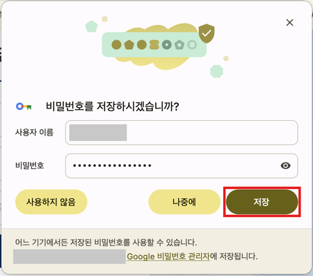

#### 2단계. 계정이 저장되었는지 확인하기

> 📍 **주소:** [**`chrome://password-manager/passwords`**](chrome://password-manager/passwords)

위 주소를 크롬 주소창에 붙여넣고 `mju`로 검색합니다. 목록에 `mju.ac.kr` 항목이 있고, 그 항목을 열었을 때 사이트 목록에 `sso.mju.ac.kr`이 포함되어 있으면 됩니다. 이 사이트에 저장된 계정이 둘 이상이면 크롬이 어느 계정을 넘겨줄지 결정할 수 없으므로, 계정은 하나만 저장되어 있어야 합니다.


| 목록에서 `mju.ac.kr` 확인                                                            | 사이트 목록에서 `sso.mju.ac.kr` 확인                                                            |
| ------------------------------------------------------------------------------ | -------------------------------------------------------------------------------------- |
| 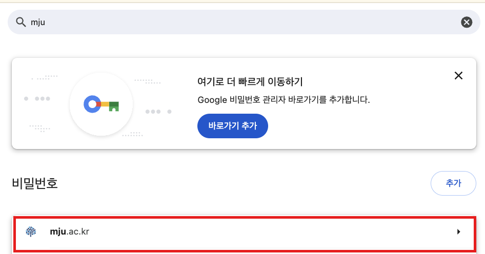 | 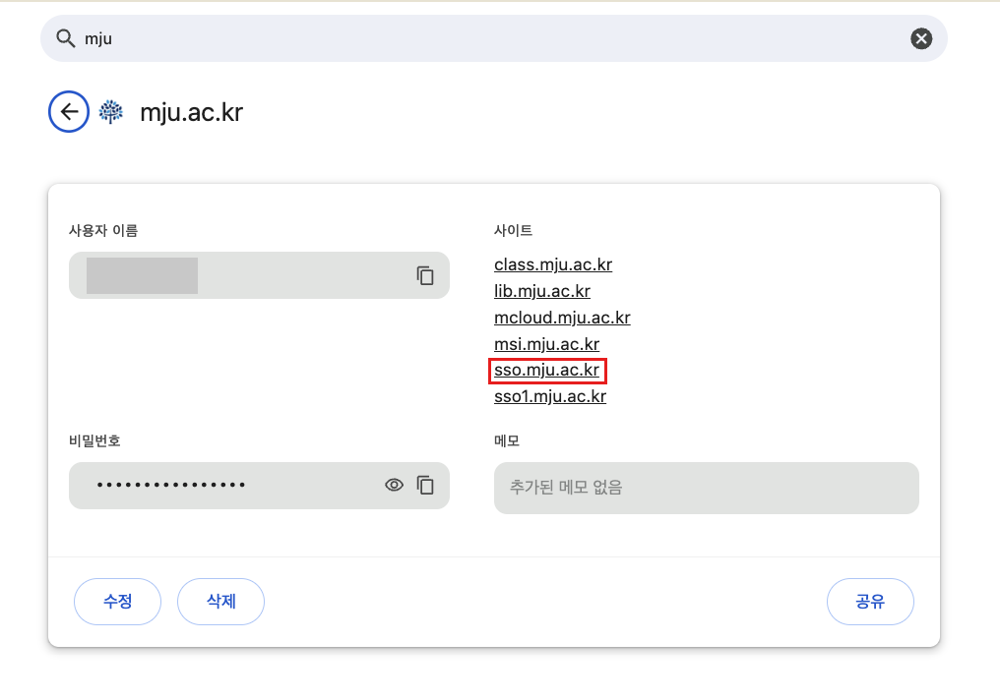 |


#### 3단계. 크롬 비밀번호 설정 바꾸기

> 📍 **주소:** [**`chrome://password-manager/settings`**](chrome://password-manager/settings)

위 주소에서 두 가지 설정을 확인합니다. **자동으로 로그인**은 켜져 있어야 하고, **비밀번호 입력 시 화면 잠금 사용**은 꺼져 있어야 합니다.  
화면 잠금이 켜져 있으면 크롬은 저장된 비밀번호를 쓸 때마다 지문 같은 생체 인증이나 기기 암호를 요구하므로,  
자동 로그인이 동작하지 않습니다.

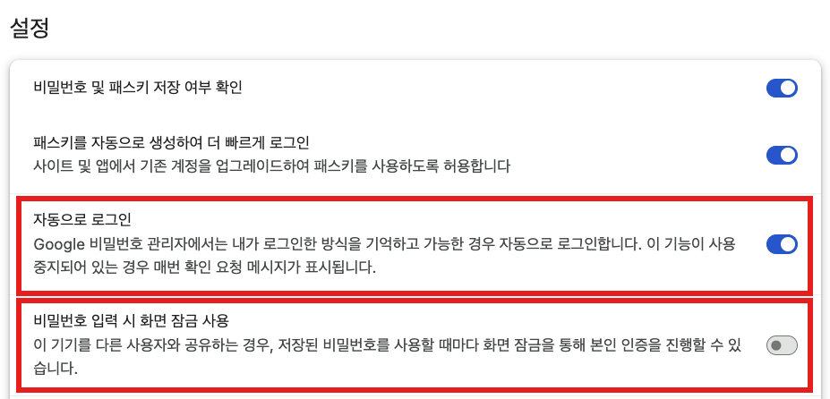

#### 준비 점검

- [ ] 크롬 비밀번호 관리자에 통합로그인 계정이 **하나** 저장되어 있다
- [ ] **자동으로 로그인**이 켜져 있다
- [ ] **비밀번호 입력 시 화면 잠금 사용**이 꺼져 있다


&nbsp;

---

---

---

---

---

---


&nbsp;

## 엣지 준비

엣지는 저장된 계정을 확장 프로그램에 넘겨주지 않는 대신, 로그인 화면의 입력칸을 직접 채워 둡니다. 확장 프로그램은 엣지가 채워 둔 값으로 로그인 버튼을 누릅니다.

#### 1단계. 통합로그인 계정을 엣지에 저장하기

[명지대 통합로그인](https://sso.mju.ac.kr)에서 한 번 직접 로그인하고, 엣지가 암호 저장을 물으면 **저장**을 누릅니다. 크롬에 저장한 계정은 엣지로 넘어오지 않으므로 엣지에서 따로 저장해야 합니다.

#### 2단계. 엣지 자동 채우기 설정 바꾸기

> 📍 **주소:** **`edge://settings/autofill/passwords/settings`**

**암호 및 암호 자동 채우기**를 켜고, 그 아래 두 항목 중 **"웹 사이트 암호를 입력하고 자동으로 로그인하거나 사용 가능한 암호를 제안합니다."**를 선택합니다. "디바이스 로그인 옵션을 묻는" 항목이 선택되어 있으면 엣지가 입력칸을 채우지 않으므로 자동 로그인이 동작하지 않습니다.

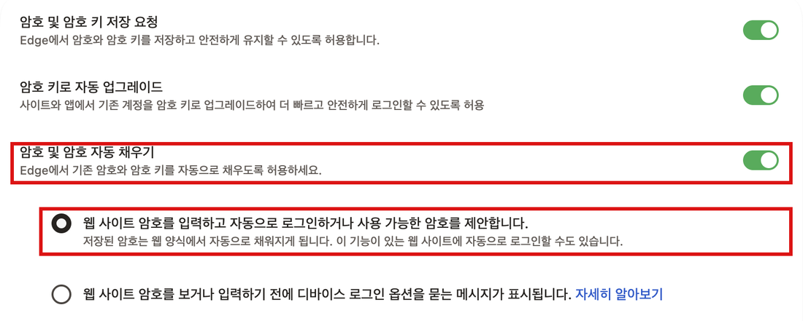

#### 디버깅 안내 띠

엣지에서는 자동 로그인이 진행되는 순간 화면 위쪽에 디버깅을 시작했다는 안내 띠가 잠깐 나타났다가 사라집니다. 확장 프로그램이 엣지가 채워 둔 입력칸을 쓰기 위해 디버거 기능을 잠깐 사용하기 때문이며, 따로 누를 필요는 없습니다. 이유는 [엣지 지원 추가](#엣지-지원-추가)에서 설명합니다.

#### 준비 점검

- [ ] 엣지에 통합로그인 계정이 저장되어 있다
- [ ] 자동 채우기 설정에서 **"웹 사이트 암호를 입력하고 자동으로 로그인…"**이 선택되어 있다

## 설치

[크롬 웹 스토어](https://chromewebstore.google.com/detail/mhhpalifnkkbgoonlnnpcojllkiblbca)에서 **Chrome에 추가**를 누릅니다. 엣지에서도 같은 페이지에서 설치할 수 있으며, 처음 한 번 "다른 스토어의 확장 허용"을 눌러야 합니다.

엣지 지원은 0.3.0 버전부터 들어갑니다. 스토어에 0.3.0이 반영되기 전에 엣지에서 쓰려면 직접 설치해야 합니다.

1. 이 저장소를 내려받아 압축을 풉니다. (`Code` → `Download ZIP`)
2. 주소창에 `chrome://extensions`(엣지는 `edge://extensions`)를 입력하고 **개발자 모드**를 켭니다.
3. **압축해제된 확장 프로그램 로드**(엣지는 **압축 풀린 확장 로드**)를 누르고, 압축을 푼 폴더를 선택합니다.

설치가 끝나면 평소처럼 아스트라(LMS)나 MSI에 접속하시면 됩니다.

## 켜고 끄기

자동 로그인은 언제든 켜고 끌 수 있습니다. 브라우저 툴바에서 확장 프로그램 아이콘을 누르면 나오는 창의 스위치로 설정하며, 꺼 두면 확장 프로그램이 없을 때와 똑같이 동작합니다. 설정은 브라우저를 다시 열어도 유지됩니다.

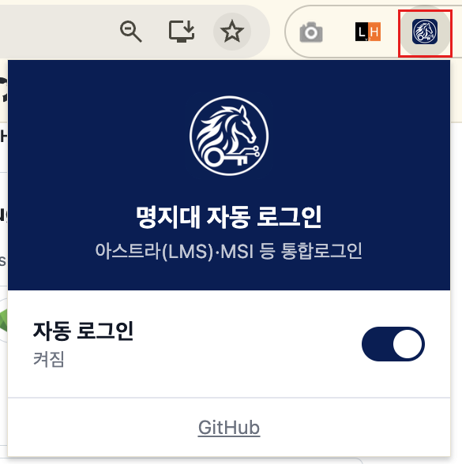

## 개인정보

확장 프로그램은 비밀번호를 저장하지 않습니다. 크롬에서는 로그인할 때마다 크롬 비밀번호 관리자에서 받아 입력칸에 넣고, 엣지에서는 엣지가 채워 둔 입력칸을 그대로 제출할 뿐 비밀번호를 읽지 않습니다. 어떤 정보도 외부로 전송하지 않고, 동작하는 범위는 `lms.mju.ac.kr`과 `sso.mju.ac.kr` 두 곳으로 제한되어 있습니다. 디버거 권한은 엣지에서 통합로그인 탭에 잠깐 붙었다 떨어지는 데에만 사용합니다. 자세한 내용은 [개인정보처리방침](PRIVACY.md)에 있습니다.


&nbsp;

---

---

---

---

---


&nbsp;

# 개발 기록

## 처음 생각한 문제

명지대 아스트라(LMS)는 브라우저를 닫았다가 다시 열면 항상 로그아웃되어 있습니다. 다시 접속하려면 "접속이 종료되었습니다"라는 알림을 닫고, 로그인 페이지로 이동해 저장된 계정을 고른 뒤 로그인 버튼을 누릅니다. 그러고 나면 매번 비밀번호 변경을 권하는 페이지가 나타나므로 취소 버튼까지 눌러야 비로소 아스트라 메인에 도착합니다. 강의 하나를 보기 위해 매번 다섯 번의 클릭을 거쳐야 했습니다.


| ① "접속이 종료되었습니다" 알림 닫기                                               | ② 아스트라 로그인 화면에서 통합로그인으로 이동                                           |
| ------------------------------------------------------------------- | -------------------------------------------------------------------- |
| 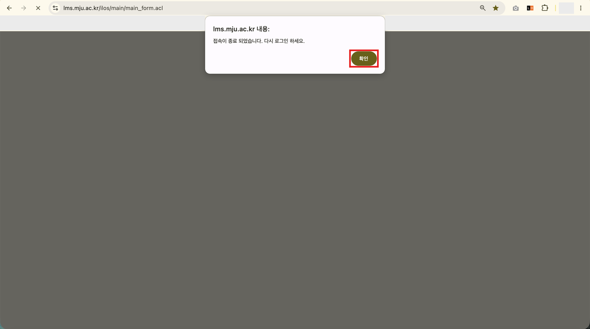         | 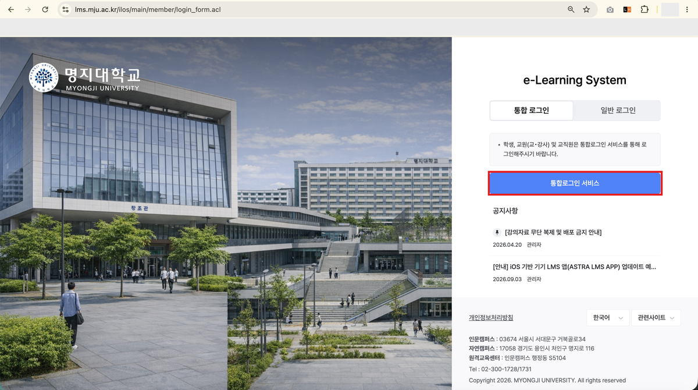 |
| **③ 계정 선택 후 로그인**                                                   | **④ 비밀번호 변경 안내에서 취소**                                                |
| 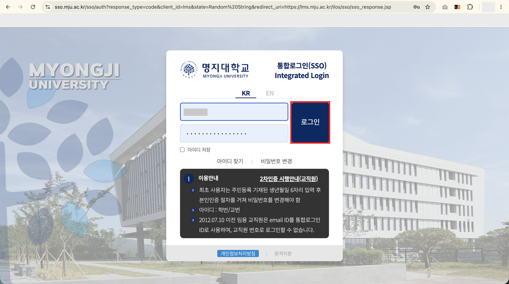 | 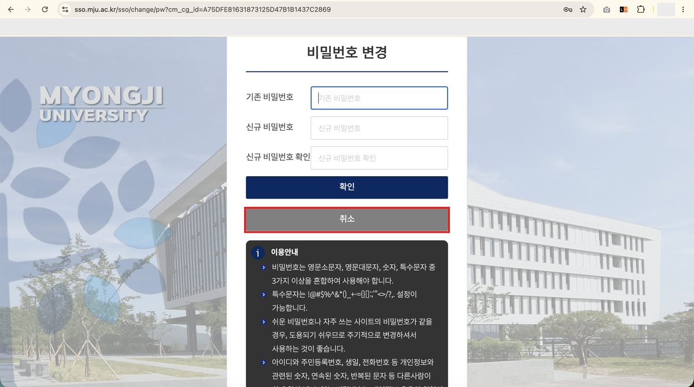      |


그래서 처음에는 이 문제를 "로그인 상태가 유지되지 않는다"로 보았습니다. 브라우저를 닫아도 로그인이 남아 있게 만들 수 있다면 위의 과정 자체가 필요 없어지기 때문입니다.

## 조사하며 발견한 한계

로그인이 왜 풀리는지 알기 위해 먼저 쿠키를 확인했습니다. 아스트라의 로그인 상태는 `JSESSIONID`라는 쿠키에 담기는데, 이 쿠키에는 만료 시각이 지정되어 있지 않았습니다. 만료 시각이 없는 쿠키는 세션 쿠키로 취급되어 브라우저가 종료될 때 함께 삭제됩니다. 같은 사이트의 언어 설정이나 통계용 쿠키는 2027년까지 만료일이 정해져 있었으므로, 로그인 쿠키만 의도적으로 브라우저를 닫으면 사라지게 만든 것으로 보입니다. 쿠키 이름으로 미루어 아스트라는 자바 기반 서버(톰캣)에서 동작하고 있었습니다.

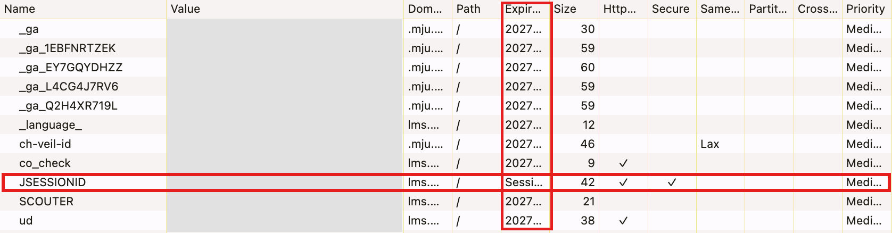

브라우저가 쿠키를 지우지 않도록 하면 해결될 것 같지만, 그것만으로는 충분하지 않습니다. 서버는 로그인한 사용자의 정보를 서버 쪽 세션에 보관하고, 일정 시간 동안 요청이 없으면 그 세션을 지웁니다. 톰캣의 기본 세션 타임아웃은 30분입니다. 아스트라의 실제 설정값은 측정하지 못했지만, 어떤 값이든 브라우저가 꺼져 있는 동안에는 서버에 요청을 보낼 수 없으므로 세션이 만료되는 것을 막을 수 없습니다. 쿠키가 남아 있더라도 그 쿠키가 가리키는 서버 세션이 이미 사라진 뒤라면 로그인은 풀립니다.

결국 로그인 상태를 유지하는 것은 클라이언트가 통제할 수 있는 영역이 아니었습니다.

## 최종 문제 정의

로그인이 풀리는 것을 막을 수 없다면, 풀린 뒤에 다시 로그인하는 과정을 사람이 하지 않도록 만들면 됩니다. 그래서 문제를 다음과 같이 다시 정의했습니다.

> 로그아웃 상태에서 사이트에 접속했을 때, 사람이 하던 재로그인 과정을 자동으로 수행해 원래 사이트로 돌려보낸다.

이를 위해 실제 로그인 과정을 개발자도구의 네트워크 기록으로 분석했습니다. 아스트라는 로그인이 필요하면 사용자를 명지대 통합로그인 서버(`sso.mju.ac.kr`)로 보냅니다. 사용자가 그곳에서 아이디와 비밀번호를 제출하면 통합로그인 서버는 비밀번호 변경 안내 페이지를 거쳐, 일회용 코드를 붙여 사용자를 다시 아스트라로 돌려보냅니다. 아스트라는 이 코드를 확인한 뒤 새 세션을 발급합니다. 이는 OAuth 2.0의 인가 코드 방식과 같은 구조입니다. 또한 비밀번호는 로그인 페이지의 스크립트가 제출 직전에 브라우저에서 암호화해 전송하고 있었습니다.

이 흐름에서 사람이 개입하는 지점은 로그인 페이지로 이동하는 것, 아이디와 비밀번호를 입력해 제출하는 것, 비밀번호 변경 안내를 취소하는 것의 세 곳입니다. 이 중 페이지 이동과 취소는 정해진 주소로 이동하기만 하면 되므로 어렵지 않습니다. 남은 문제는 단 하나, **자동으로 입력할 비밀번호를 어디서 가져올 것인가**였습니다.

이 질문에 답하기 위해 다음 조건을 정했습니다. 사람의 클릭이나 입력 없이 전부 자동으로 동작해야 하고, 설치는 크롬 확장 프로그램 하나로 끝나야 하며, 다른 학생들에게 배포할 수 있어야 합니다. 그리고 배포를 고려하면 다른 사람의 통합로그인 비밀번호를 확장 프로그램이 그대로 보관하는 일은 피해야 했습니다.

## 해결방법들

가장 먼저 떠오르는 방법은 크롬의 자동 완성에 맡기고 확장 프로그램은 로그인 버튼만 누르는 것입니다. 그러나 크롬의 자동 완성은 사용자가 페이지를 직접 클릭하는 동작을 전제로 하며, 확장 프로그램이 이를 대신 실행할 수 있는 방법은 기본적으로 제공되지 않습니다. 이 방법은 뒤의 [엣지 지원 추가](#엣지-지원-추가)에서 다시 다룹니다.

다음으로 확장 프로그램의 저장소에 비밀번호를 직접 저장하는 방법이 있습니다. 완전한 자동화가 가능하지만 비밀번호가 평문으로 남게 됩니다. 이를 보완하기 위해 확장 프로그램 안에서 비밀번호를 암호화하는 방법도 검토했지만, 사람의 개입 없이 복호화하려면 열쇠 역시 확장 프로그램 안에 함께 저장해야 합니다. 열쇠가 자물쇠 옆에 있는 암호화는 실질적인 보호가 되지 못합니다.

열쇠를 안전한 곳에 두는 방법도 있습니다. 패스키(WebAuthn)로 열쇠를 만들면 보호는 확실하지만 열쇠를 꺼낼 때마다 생체 인증 같은 사용자 확인이 필요합니다. 맥 키체인에 비밀번호를 보관하고 별도의 도우미 프로그램이 이를 꺼내 확장 프로그램에 전달하는 방법은 크롬 자신이 비밀번호를 보호하는 방식과 같은 구조여서 안전하고 자동화도 가능하지만, 확장 프로그램과 도우미 프로그램 두 가지를 설치해야 합니다.

마지막으로 검토한 것이 웹 표준인 Credential Management API입니다. 이 API를 사용하면 웹페이지가 브라우저에게 해당 사이트에 저장된 계정을 요청할 수 있고, `mediation: "silent"` 옵션을 주면 사용자에게 묻지 않고 조용히 넘겨받을 수 있습니다.

```js
navigator.credentials.get({ password: true, mediation: "silent" })
```

## 선택한 방법과 그 이유

최종적으로 Credential Management API를 선택했습니다. 앞의 대안들이 자동화, 비밀번호 보호, 단일 설치라는 세 조건 중 적어도 하나를 포기해야 했던 것과 달리, 이 방법은 비밀번호의 보관을 크롬 비밀번호 관리자에 맡김으로써 세 조건을 대부분 만족합니다. 확장 프로그램은 비밀번호를 저장하지 않고, 로그인 페이지가 열릴 때마다 크롬에게서 받아 입력칸에 넣기만 합니다.

다만 문서상으로 가능하다는 것과 실제로 동작하는 것은 별개이므로, 코드를 작성하기 전에 통합로그인 페이지의 콘솔에서 Credential Management API를 직접 호출해 보았습니다. 첫 시도에서 크롬은 계정을 돌려주지 않았습니다. 원인은 크롬의 "비밀번호 입력 시 화면 잠금 사용" 설정이었고, 이 설정을 끈 뒤 다시 호출하자 아이디와 비밀번호를 모두 받을 수 있었습니다.

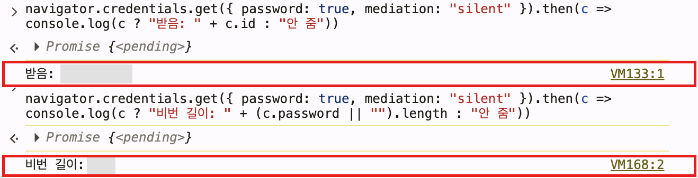

크롬의 화면 잠금은 저장된 비밀번호를 사용할 때마다 본인 인증을 요구하는 보호 장치이며, 이를 꺼야만 자동화가 가능합니다. 따라서 잠금이 풀린 컴퓨터를 다른 사람이 사용하면 저장된 비밀번호로 로그인될 수 있습니다. 개인 컴퓨터에서는 받아들일 수 있는 수준이라고 판단했지만, 앞서 말한 "비밀번호 보호" 조건을 완전히 만족한다고 보기는 어렵습니다.

비밀번호를 얻은 뒤의 처리에서도 같은 기준으로 선택했습니다. 로그인 페이지는 비밀번호를 제출 직전에 암호화하는데, 이 암호화를 확장 프로그램에서 다시 구현하면 명지대가 암호화 방식을 바꾸는 순간 동작하지 않게 됩니다. 그래서 확장 프로그램은 입력칸에 값을 채우고 페이지의 로그인 버튼을 누르기만 하며, 암호화는 명지대 페이지가 원래대로 수행하도록 두었습니다. 같은 이유로 입력칸은 현재의 요소 이름으로 먼저 찾되, 찾지 못하면 "비밀번호 칸이 하나인 폼과 그 앞의 입력칸"이라는 구조로 다시 찾습니다. 비밀번호 칸이 하나인 폼으로 한정한 것은 칸이 여러 개인 비밀번호 변경 폼에 잘못 입력하는 일을 막기 위해서입니다.

또한 저장된 비밀번호가 틀렸을 때 자동으로 재시도를 반복하면 계정이 잠길 수 있습니다. 그래서 자동 제출 후 15초 안에 다시 로그인 페이지가 나타나면 실패로 판단하고, 사용자가 직접 다시 켜기 전까지는 더 이상 시도하지 않도록 했습니다. 처음에는 이 기준을 1분으로 두었지만, 비밀번호 변경 안내가 나오지 않는 계정은 로그인 직후 직접 로그아웃한 경우까지 실패로 착각할 수 있어 줄였습니다. 비밀번호가 틀린 경우 로그인 페이지는 몇 초 안에 다시 나타납니다.

## 결과와 한계

브라우저를 완전히 종료했다가 다시 연 상태에서 아스트라와 MSI 모두 자동으로 로그인되는 것을 확인했습니다. 재로그인에 필요하던 다섯 번의 클릭은 모두 없어졌습니다. MSI는 따로 처리하지 않았지만, 같은 통합로그인 서버를 사용하므로 같은 방식으로 동작했습니다.

한계도 남아 있습니다. 먼저, 사용하기 전에 준비가 필요합니다. 크롬 비밀번호 관리자에 통합로그인 계정을 미리 저장해 두어야 하고, "자동으로 로그인"을 켜고 "비밀번호 입력 시 화면 잠금 사용"을 끄는 설정도 직접 바꿔야 합니다. 확장 프로그램을 설치하는 것만으로 끝나지 않기 때문에, 사용자 입장에서는 번거롭게 느껴질 수 있습니다.

또한 이 확장 프로그램은 현재 아스트라와 통합로그인의 로그인 과정에 맞추어 동작합니다. 명지대가 2단계 인증을 도입하는 등 로그인 과정을 바꾸면, 확장 프로그램을 그에 맞게 고치기 전까지는 사용할 수 없게 됩니다.

## 엣지 지원 추가

크롬 버전을 공개한 뒤, 엣지를 쓰는 사용자도 같은 방식으로 쓸 수 있는지 확인했습니다.

### 엣지에서 생긴 문제

엣지도 크롬과 같은 크로미움 기반이므로 같은 코드가 그대로 동작할 것으로 예상했습니다. 확장 프로그램 설치와 실행은 문제없었지만, 통합로그인 화면에서 "저장된 계정을 받지 못했다"는 안내가 떴습니다. 엣지는 같은 화면의 입력칸에 학번과 비밀번호를 직접 채워 두었으므로, 계정이 저장되어 있지 않은 것은 아니었습니다.

콘솔에서 확인한 결과는 다음과 같았습니다.


| 시험                                      | 결과             |
| --------------------------------------- | -------------- |
| `mediation: "silent"`로 계정 요청            | 빈 값(`null`)    |
| `mediation: "optional"`로 계정 요청          | 계정 선택 창 없이 빈 값 |
| `navigator.credentials.store`로 시험 계정 저장 | 저장 창이 정상적으로 뜸  |
| 시험 계정을 저장한 뒤 다시 요청                      | 여전히 빈 값        |


저장은 되는데 꺼내기만 항상 빈 값이었습니다. 엣지 설정을 바꾸는 것으로는 달라지지 않았고, 엣지가 API를 갖추고 있으면서 계정을 꺼내 주는 쪽만 막아 둔 것으로 보였습니다.

### 원인 조사

추측으로 끝내지 않기 위해 사용자의 프로필과 분리된 임시 프로필로 엣지와 크롬을 띄우고, 같은 계정 데이터를 넣어 같은 조건에서 비교했습니다. 엣지 실행 파일에 들어 있는 문자열을 조사해 `msEdgeShowCredentialManagerAccountChooser`라는 엣지 전용 기능 스위치를 찾았고, 크로미움에는 "자동 로그인 첫 안내를 한 번 보기 전에는 조용히 계정을 넘겨주지 않는다"는 규칙이 있다는 것도 확인했습니다.


| 조건                | 크롬        | 엣지                                 |
| ----------------- | --------- | ---------------------------------- |
| 기본 상태             | 빈 값       | 빈 값                                |
| "첫 안내를 보았음" 설정만 켬 | **계정 받음** | 빈 값                                |
| 엣지 전용 스위치만 켬      | –         | `silent`는 빈 값, `optional`은 선택 창이 뜸 |
| 둘 다 켬             | –         | **계정 받음**                          |


크롬에서 처음부터 동작했던 것은 사용자가 이미 첫 안내를 거친 상태였기 때문이고, 엣지는 여기에 더해 기능 스위치 자체가 꺼져 있었던 것입니다.

### 첫 번째 해결책과 그 한계

실제 엣지를 이 스위치를 켠 채로 실행하고 한 번 계정을 고르자, 크롬과 똑같이 클릭 없이 자동 로그인되었습니다. 하지만 이 스위치는 `edge://flags`에도 없어 엣지를 실행할 때 명령줄 옵션으로만 켤 수 있고, 엣지를 다시 열 때마다 사라집니다. 사용자에게 매번 터미널 명령을 요구하거나 실행용 앱을 따로 설치하게 하는 것은 "설치 하나로 끝나야 한다"는 조건에 맞지 않았고, Microsoft가 공개하지 않은 스위치라 언제든 없어질 수 있었습니다. 또한 맥과 윈도우 모두에서 사용자가 따로 손대지 않고 동작해야 했습니다.

### 최종 해결책: 브라우저가 채워 둔 입력칸 사용

그래서 처음에 제외했던 자동 완성을 다시 살펴보았습니다. 엣지는 로그인 화면에 들어가면 저장된 계정으로 입력칸을 채워 둡니다. 다만 크로미움은 비밀번호를 빼내는 스크립트를 막기 위해, 사람이 페이지를 한 번 클릭하거나 키를 누르기 전까지는 채워 둔 값을 페이지 코드에 빈 값으로 보여줍니다. 확장 프로그램이 코드로 만든 클릭은 사람의 입력으로 인정되지 않으므로 이 잠금을 풀 수 없습니다.

임시 프로필에 가짜 계정을 넣고, 같은 로그인 화면에서 방법별로 제출되는 비밀번호의 길이를 측정했습니다. 엣지와 크롬의 결과는 같았습니다.


| 방법                      | 제출된 비밀번호 길이   |
| ----------------------- | ------------- |
| 확장 프로그램 방식대로 코드에서 버튼 클릭 | 0 (빈 비밀번호 제출) |
| 디버거로 "사용자 입력" 표시를 붙여 실행 | 원래 길이         |
| 디버거로 마우스 클릭 전달          | 원래 길이         |


브라우저의 디버거 기능(Chrome DevTools Protocol)으로 보낸 동작은 사람의 입력으로 인정되어 잠금이 풀렸습니다. 확장 프로그램은 `chrome.debugger` API로 같은 기능을 쓸 수 있습니다.

이에 따라 계정을 넘겨받지 못한 경우에는 다음 순서로 동작하도록 했습니다.

1. 비밀번호 칸이 브라우저에 의해 자동으로 채워져 있는지 확인합니다(`:autofill`). 채워져 있지 않으면, 즉 계정이 저장되어 있지 않으면 여기서 멈추고 안내만 표시합니다.
2. 통합로그인 탭에 디버거를 잠깐 붙여 "사용자 입력" 표시가 붙은 빈 실행을 한 번 보내고, 곧바로 뗍니다.
3. 입력칸의 값이 풀리면 페이지의 로그인 버튼을 누릅니다. 암호화와 제출은 크롬에서와 마찬가지로 명지대 페이지가 수행합니다.

이 과정에서도 확장 프로그램은 비밀번호를 읽거나 저장하지 않습니다. 디버거 요청은 명지대 통합로그인 페이지의 최상위 화면에서 보낸 것만 받도록 제한했습니다. 크롬에서는 지금까지처럼 Credential Management API로 계정을 받으므로 이 과정을 거치지 않습니다.

### 결과와 한계

엣지를 평소처럼 연 상태에서 클릭 없이 자동 로그인되는 것을 확인했습니다. 엣지 사용자는 계정을 저장하고 자동 채우기 설정을 확인하는 것 외에 추가로 할 일이 없습니다.

대가도 있습니다. `debugger` 권한이 추가되어 설치할 때 이 권한에 대한 안내가 표시되며, 크롬 웹 스토어 심사에서도 더 자세한 설명이 필요합니다. 또한 엣지에서는 디버거가 붙는 동안 브라우저가 화면 위쪽에 디버깅 안내 띠를 띄우므로, 로그인할 때마다 이 띠가 잠깐 나타납니다. 브라우저가 사용자를 보호하기 위해 표시하는 것이라 확장 프로그램에서 숨길 수 없습니다. 마지막으로, 윈도우의 엣지는 같은 크로미움 코드를 쓰므로 같은 방식으로 동작할 것으로 예상하지만 직접 확인하지는 못했습니다.

---

## 기여

버그 제보와 제안은 [이슈](https://github.com/heyoonyoon/mju-auto-login/issues)로, 코드 수정은 Pull Request로 보내 주시기 바랍니다.

## 라이선스

이 프로젝트는 [MIT License](LICENSE)로 배포됩니다. 명지대학교의 공식 프로그램이 아니며, README에 포함된 명지대학교 웹페이지 화면의 권리는 명지대학교에 있습니다.